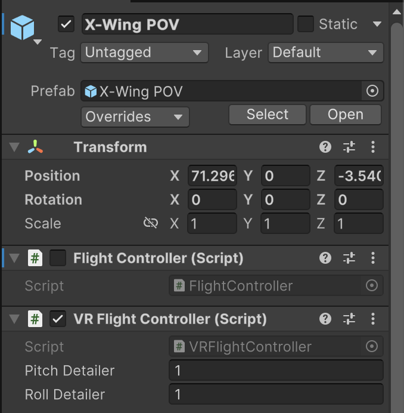

# X-Wing VR

Step into the cockpit of an X-Wing and experience the thrill of intergalactic combat in X-Wing VR, a Star Wars-inspired virtual reality adventure. Take control of your ship’s joystick, manage thrust to outmaneuver enemies, and unleash laser fire in intense space battles.

Your mission: evade relentless TIE-Interceptors, destroy as many as you can, and navigate through a hazardous field of Imperial cruisers and meteorites. Survive the onslaught, master your piloting skills, and prove your worth as the galaxy’s finest pilot.

Will you outfly your foes or crash and burn in the depths of space? The fate of the stars rests in your hands!

## For developers:

In the **X-Wing POV** prefab there are 2 controllers:

#### `FlightController` (disabled on default):

Has an input on right and left stick of both **Gamepad** and **XR controller**. Use when not testing within VR environment for easier use.

#### `VRFlightController` (enabled on default):

Tracks the XR controllers as inputs and has the **Direct Interactable** component, meaning you need to be close to the 3D object (interactable) with the controller to be able to grab it and interact with it. Here the movement of the joystick and thrust controllers is translated into the speed and rotation of the ship. 

## Credits / Sources:

#### [Valem Tutorials](https://www.youtube.com/@ValemTutorials):

- Lets make a VR game unity package (`XRJoystick`, `XRSlider`, and hands visuals)
